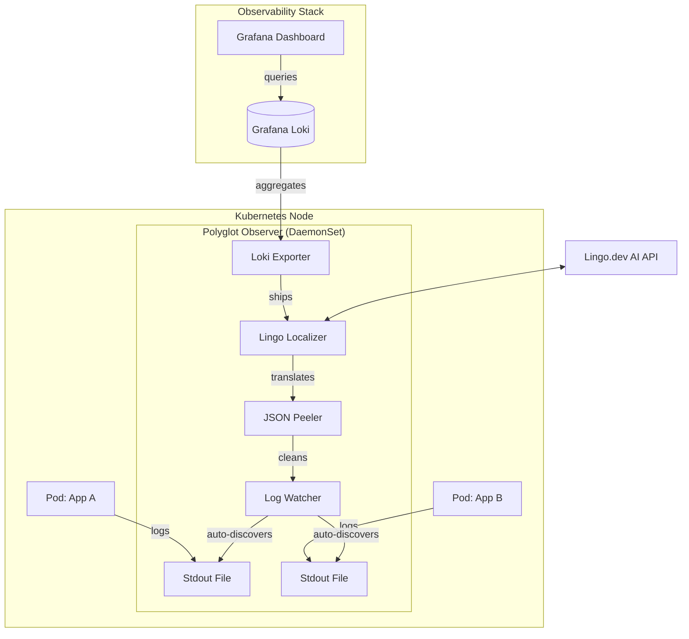

# Polyglot Observer 🌍🚀

**The Universal Node Observer** is a high-performance, multilingual observability agent built in Rust. It automatically discovers logs from any container running in a Kubernetes cluster, localizes them into a target language using AI, and ships them to a centralized dashboard.

---

## 🏗 Architecture

The project follows the **Cloud-Native DaemonSet Pattern**. It runs as a single agent per node, watching all application logs from the outside without requiring any changes to the applications themselves.



---

## ✨ Key Features

*   **⚡ Zero-Touch Discovery:** Automatically detects and monitors new pods as they are deployed, with no restarts required.
*   **🌐 Real-time AI Localization:** Uses the Lingo.dev API to translate technical error messages into your preferred language (e.g., English to Spanish).
*   **🛡 Technical Truth Preservation:** Intelligent regex masking ensures that UUIDs, Trace IDs, and timestamps are never modified during translation.
*   **📦 Multi-App Isolation:** Correctly identifies and labels logs by `namespace`, `pod`, and `container`, allowing for perfect isolation in Grafana.
*   **🧹 Recursive JSON Peeling:** Peels away Kubernetes JSON wrappers to ensure only clean, human-readable text reaches your dashboard.

---

## 🚀 Getting Started

### Prerequisites
*   A Kubernetes Cluster (Minikube or Docker Desktop).
*   A Lingo.dev API Key.
*   [Helm](https://helm.sh/) installed.

### 1. Install the Observability Brain (Loki Stack)
```bash
helm repo add grafana https://grafana.github.io/helm-charts
helm repo update
helm install loki-stack grafana/loki-stack --set promtail.enabled=false --set grafana.enabled=true
```
*(Note: We disable Promtail to prevent raw English duplicates from cluttering the dashboard.)*

### 2. Configure & Deploy the Observer
1.  Update your API key in `polyglot-observer/k8s-config.yaml`.
2.  Apply the manifests:
```bash
kubectl apply -f polyglot-observer/k8s-config.yaml
kubectl apply -f polyglot-observer/k8s-daemonset.yaml
```

---

## 🔍 How it Works (The Pipeline)

1.  **Discovery:** The agent scans `/var/log/pods` every 5 seconds. It follows symlinks into `/var/lib/docker/containers` to gain read access to the actual data.
2.  **Peeling:** Standard K8s logs are JSON-wrapped. Our "Recursive Peeler" extracts the raw message string.
3.  **Localization:** The message is sent to Lingo.dev. If the API is unavailable, it uses a best-effort local fallback.
4.  **Export:** The clean, translated message is pushed to Loki with standard Kubernetes labels for instant dashboard integration.

---

## 📊 Dashboard Access
Once deployed, port-forward Grafana to view your logs:
```bash
kubectl port-forward svc/loki-stack-grafana 3000:80
```
**Query Example (LogQL):** `{container="your-app-name"}`

---

Developed with ❤️ for the Lingo.dev Hackathon.
