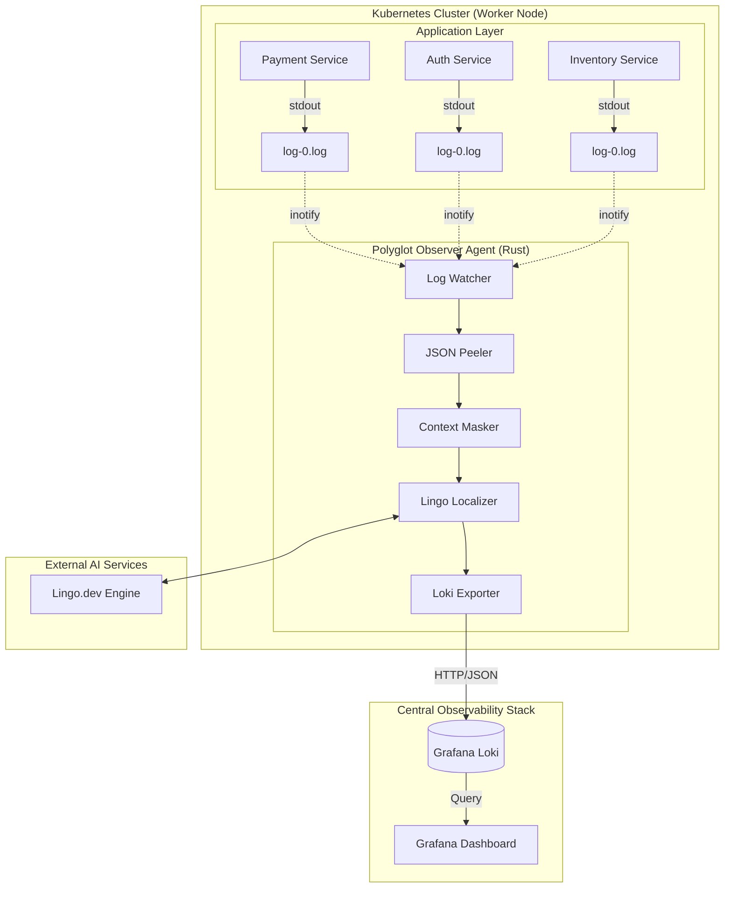

# Polyglot Observer: The Universal Multilingual Observability Agent 🌍🚀

[](https://www.rust-lang.org/)
[](https://kubernetes.io/)
[](https://lingo.dev/)

**Polyglot Observer** is a high-performance, AI-powered observability agent designed to bridge the language gap in global engineering teams. Built in Rust for maximum efficiency and safety, it monitors Kubernetes container logs from the outside, localizes technical error messages into a target language in real-time, and ships them to a centralized Grafana Loki dashboard.

---

## 🏗 High-Level Architecture

The project implements the **DaemonSet Pattern**, ensuring a single "Observer" agent runs on every node in the cluster. This allows the agent to read logs directly from the node's filesystem, making it platform-agnostic and requiring **zero changes** to your application code.



---

## 🛠 Technical Deep Dive

### 1. The Discovery Engine (`LogWatcher`)
*   **Real-time Auto-discovery:** Uses a background polling loop combined with the `glob` crate to detect new pod log files every 5 seconds.
*   **Symlink Resolution:** Kubernetes logs in `/var/log/pods` are symbolic links. The agent mounts `/var/lib/docker/containers` to correctly follow these links and gain low-level read access to the actual data.
*   **Namespace Filtering:** Features a high-performance exclusion list (configured via `EXCLUDE_NAMESPACES`) to skip system noise from `kube-system` or `istio-system`.

### 2. The AI Pipeline (`LingoLocalizer`)
*   **Recursive JSON Peeling:** Kubernetes wraps every log line in a JSON envelope. Our custom logic recursively "peels" these layers to find the innermost clean text string for translation.
*   **Technical Truth Preservation:** Before sending text to the AI, we use specialized Regex patterns to identify and "mask" technical identifiers like:
    *   UUIDs / GUIDs
    *   Trace IDs / Span IDs
    *   Timestamps
    *   IP Addresses
    *   *Result:* The AI translates the context (e.g., "Connection failed") but leaves the ID (e.g., `550e8400-e29b...`) untouched.
*   **Exponential Backoff:** Built-in resilience logic retries failed API calls with increasing delays.

### 3. The Isolation Exporter (`LokiExporter`)
*   **Identity Impersonation:** Extracts `namespace`, `pod`, and `container` names from the log path and attaches them as standard Loki labels.
*   **Stream Integrity:** By using standard labels, your localized logs appear in Grafana exactly where you expect them, allowing you to use existing dashboards without modification.

---

## 🚀 Deployment Guide

### Prerequisites
*   A running Kubernetes cluster (Minikube, EKS, GKE, etc.)
*   [Helm](https://helm.sh/) v3+
*   A Lingo.dev API Key (`lingo_sk_...`)

### 1. Install the Logging Backend
We use the standard Grafana-Loki stack. We disable the default `promtail` agent to ensure only our localized logs appear in the dashboard.
```bash
helm repo add grafana https://grafana.github.io/helm-charts
helm repo update
helm install loki-stack grafana/loki-stack \
  --set promtail.enabled=false \
  --set grafana.enabled=true
```

### 2. Configure the Observer
Edit `polyglot-observer/k8s-config.yaml` and insert your `lingo_api_key`. You can also change the `target_language` (e.g., `es`, `fr`, `jp`).

### 3. Deploy to Cluster
```bash
kubectl apply -f polyglot-observer/k8s-config.yaml
kubectl apply -f polyglot-observer/k8s-daemonset.yaml
```

---

## 🔍 Verification & Troubleshooting

### Check Agent Discovery
```bash
kubectl logs -l name=lingo-observer -f
```
You should see: `New log discovered: /var/log/pods/...`

### Dashboard Querying
Access Grafana (`kubectl port-forward svc/loki-stack-grafana 3000:80`) and use LogQL:
*   **View all localized logs:** `{origin="lingo-observer"}`
*   **Filter by specific service:** `{container="payment-service"}`
*   **Filter by language:** `{language="es"}`

---

## 📂 Project Structure
```text
polyglot-observer/
├── src/
│   ├── mod/
│   │   ├── watcher.rs    # Log discovery & metadata extraction
│   │   ├── localizer.rs  # AI translation & regex masking
│   │   └── exporter.rs   # Loki HTTP client & label management
│   ├── main.rs           # Async runtime & coordination
│   ├── startup.rs        # Dependency injection
│   └── config.rs         # K8s & App configuration
├── Dockerfile            # Multi-stage Rust build (Debian-slim)
├── k8s-daemonset.yaml    # DaemonSet with privileged mounts
└── k8s-config.yaml       # ConfigMap for AI & Backend settings
```

---

## 🛡 Security & Performance
*   **Privileged Context:** Required only for `inotify` access to host logs.
*   **Resource Footprint:** Built with Rust's zero-cost abstractions, maintaining a minimal CPU/Memory footprint even under high log volume.
*   **Secret Management:** API keys are managed via Kubernetes ConfigMaps/Secrets (never hardcoded in the image).

Developed for the **Lingo.dev Hackathon** 2026.
